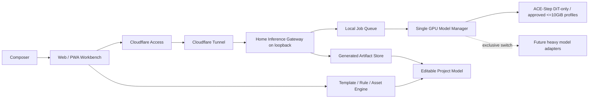
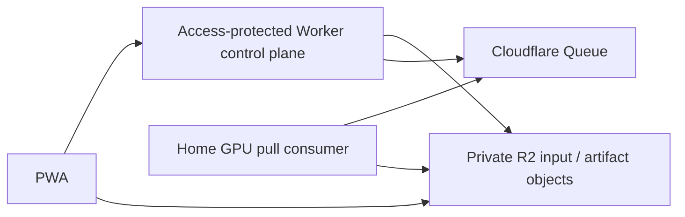

# Home Model Serving Topology

## 文書状態

`Product topology adopted / Cloudflare implementation candidate`

採用済み:

- heavy music generationは、ユーザー管理のhome RTX 5080 serverで実行する。
- Web / PWAはserverへjobを依頼できる。
- smartphoneはserver unavailableでも、生成済み候補の編集とtemplate / rule / asset workflowを完了できる。

未採用・未構築:

- Cloudflare productの最終組合せ、account、domain、Access policy、Tunnel、Worker、R2、Queues。
- home network、router、firewall、public hostnameの具体設定。

## Stage A: 最小PoC候補

Cloudflare Tunnelはhome serverからoutbound connectionを作るため、routerのinbound port forwardを不要にできる。Accessでbrowser userを認証し、`cloudflared`側でもAccess JWT validationを必須にする候補とする。

## Request flow

1. PWAでhumming / prompt / length / mood / melody constraintsをprojectへ保存する。
2. `POST /jobs`は短時間でvalidation、capability選択、job ID発行だけを行う。
3. local queueはsingle GPU workerへjobを渡す。
4. model managerが必要modelをwarm、reuse、unload / switchする。
5. clientは`GET /jobs/{id}`でpollする。WebSocketはTunnelで利用可能だが、最初はpollを優先する。
6. 完了後、artifactとprovenanceをprojectへcandidateとして取り込む。
7. AI失敗・server offline・timeout時もprojectはtemplate / rule / asset workflowへ戻る。

Cloudflare proxied HTTPのorigin read timeoutはdefault 120秒であるため、長い生成を同期HTTP responseとして待たない。10秒fixtureが速くても、warm-up、長尺、reference audio、queue待ちを含む実運用はasync jobにする。

## Model manager contract

状態候補:

`unloaded -> warming -> ready -> busy -> ready -> draining -> unloaded`

規則:

- GPU job concurrencyは最初`1`。
- 1 processのpeak reserved VRAMは10,240MiB以下をhard capとする。disk上のweight sizeではなく実測GPU reservedを判定値にする。
- ACE-Step DiT-onlyはpeak reserved 7,504MiBの実測でallowlistへ入れる。
- DiT + 1.7B LMは14,128MiBを実測したため、起動禁止profileとする。成功済みでも再実行・常駐しない。
- 未実測profileは起動しない。より軽いLM、CPU offload、別modelは、他作業を圧迫しない測定方法と停止guardを先に作ってから判断する。
- model switch前にrunning job 0を確認し、GPU cacheを解放してから次をloadする。
- warm-up見積りをjob statusへ含める。allowlist済みDiTは実測約5秒。
- Basic Pitch TSはbrowser candidateとし、home GPU availabilityから切り離す。
- server healthは`available capability`、`model state`、`queue depth`、`estimated wait`を返し、model pathやsecretを返さない。
- server healthは`current reserved VRAM`と`budget headroom`を内部監視し、capへ近づいたjobを受理しない。

## Gateway boundary

Phase 1のlocalhost実装契約（health、非同期job、artifact、10GiB guard、fallback）は [`local-ai-gateway-contract.md`](./local-ai-gateway-contract.md) に分離している。下記のAccess / Tunnel候補へ接続する前に、このlocal gateway単体でjob状態と失敗経路を検証する。

upstream model APIをそのままTunnelへ接続しない。gatewayの責任候補:

- Access identityまたはgateway sessionをjob ownerへ対応付ける。
- request schema、duration、format、size、MIME、audio decodeをvalidationする。
- idempotency key、rate limit、queue limit、timeout、cancelを扱う。
- local file pathを外へ返さず、opaque artifact IDを使う。
- prompt、humming、artifactのretentionと削除をproject policyに従わせる。
- outputへmodel / revision / seed / prompt constraint / license provenanceを付ける。
- upstream failureを正規化し、PWAへfallback可能なerror codeを返す。

## Authentication boundary

- browser / PWAはCloudflare Accessのinteractive identityを使う候補。新規Zero Trust accountではCloudflare identity providerがdefaultで、OTPも追加可能。
- Cloudflare service tokenはheadless service向けのstatic credentialであり、PWA bundleやbrowser storageへ置かない。
- Access applicationはdeny-by-default、許可userを限定し、session expiryを設定する。
- Tunnel origin側でもAccess JWT validationを有効にし、Tunnel hostnameを知るだけではoriginへ到達できない構成にする。
- CORSはPWA originだけ、gateway bindはloopback、raw ACE-Step portは公開しない。

## Upload / artifact boundary

Stage Aでは短いhumming / reference audioをAccess + Tunnel経由でgatewayへ送り、sizeを小さく制限する。Cloudflare Free / Proのproxied request body limitは100MBである。

Stage B候補:

- browser uploadはWorkerが発行する短命・single-object・operation限定のR2 presigned URL候補。
- home serverが外部infrastructureからrateを制御して取得する場合、Cloudflare QueuesのHTTP pull consumerが用途に合う候補。
- R2 / Queueはhome server offline時のbufferとartifact受渡しに有効だが、Stage Aの必須条件にしない。

## Smartphone degradation contract

| Home AI state | Smartphone behavior |
| --- | --- |
| ready | heavy generation jobを投入し、完了候補を編集できる |
| warming / busy | estimated waitを表示し、project編集を継続できる |
| offline / timeout | heavy generationをdisabled / retryableにし、template / rule / assetで作曲を継続できる |
| result expired | project内のsymbolic dataと保存済みcandidateを維持し、再生成を提案する |

AI audioをproject唯一の正本にしない。melody note / timing、chord asset、arrangement flow、instrument / FX選択、generation provenanceを保持する。

## Failure / safety scenarios

- Access unauthenticated / expired。
- Tunnel disconnected、home PC sleep、GPU worker stopped。
- queue full、duplicate submit、cancel race。
- model warm-up timeout、CUDA OOM、malformed model output。
- upload over limit、unsupported codec、decompression bomb、path traversal。
- artifact download unauthorized / expired。
- model switch中にnew jobが到着。
- Cloudflareはonlineだがhome artifact storeだけunavailable。

## Official sources checked 2026-07-21

- [Cloudflare Tunnel](https://developers.cloudflare.com/tunnel/)
- [Tunnel origin parameters and Access JWT validation](https://developers.cloudflare.com/tunnel/advanced/origin-parameters/)
- [Tunnel WebSocket support](https://developers.cloudflare.com/cloudflare-one/faq/cloudflare-tunnels-faq/)
- [Cloudflare connection limits](https://developers.cloudflare.com/fundamentals/reference/connection-limits/)
- [Workers request and response limits](https://developers.cloudflare.com/workers/platform/limits/)
- [Choose an Access application type](https://developers.cloudflare.com/cloudflare-one/access-controls/applications/choose-application-type/)
- [One-time PIN login](https://developers.cloudflare.com/cloudflare-one/integrations/identity-providers/one-time-pin/)
- [Access service tokens](https://developers.cloudflare.com/cloudflare-one/access-controls/service-credentials/service-tokens/)
- [R2 presigned URLs](https://developers.cloudflare.com/r2/api/s3/presigned-urls/)
- [Cloudflare Queues pull consumers](https://developers.cloudflare.com/queues/configuration/pull-consumers/)
