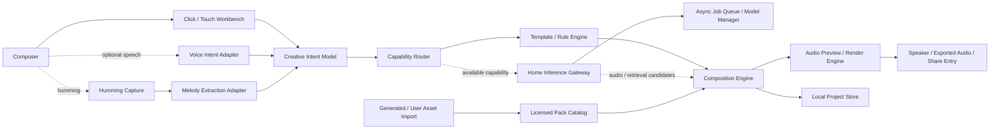

# System Context

## 文書状態

`Candidate / not adopted architecture`

- source template: `G:\devwork\tool-set\docs\setting\new-web-service-system-context-architecture-template.md`

## Context候補

## 責任候補

| Component | Responsibility | 未決 |
| --- | --- | --- |
| Workbench | blockの選択、配置、状態表示、mobile/desktop操作 | framework、画面構成 |
| Humming Capture | microphoneから本人由来のhummingを取得 | supported browser、permission、noise、recording UX |
| Melody Extraction Adapter | hummingを、最優先で編集できるpitch / timing / melody候補へ変換 | Basic Pitch TS first candidate、correction UX、fallback DSP |
| Voice Intent Adapter | speech、voice memoまたはfake inputからFX等の雰囲気指定へ変換 | speech / 口真似 / 参考audioの区別、local/OS/external、privacy |
| Creative Intent Model | humming由来melody、雰囲気、長さ、key等の本人入力を、生成と編集で保持する制約へ正規化 | schema、指示追従の確認方法、conflict処理 |
| Capability Router | task、device、model availability、license mode、failureに応じてAI adapterまたはfallbackを選ぶ | capability contract、timeout、health、user表示 |
| Template / Rule Engine | chord、arrangement flow、instrument、FXをAIなしで候補化・互換性調整 | rule schema、asset量、genre pack |
| Composition Engine | section、track、block互換性、melody pitch / rhythm編集、arrangement flowの交換 | domain model、arrangement asset schema、rules |
| Audio Engine | preview、schedule、mix、offline render | Web/native、latency |
| Project Store | manual save、load、project file、migration、undo / redo state | browser storage / downloadable file、schema |
| Pack Catalog | chord候補、展開asset、instrument、FX preset、生成・user-owned assetのmetadataとlicense | format、Studio One等のexport/import、validation、project同梱 |
| Home Inference Gateway | Web / PWAからuser-managed RTX 5080へasync jobを受け、capability別adapter、job ownership、artifact ID、provenanceを返す | Cloudflare Access + Tunnel候補、live identity / domain / retention未決 |
| Async Job Queue / Model Manager | single GPU worker、10,240MiB peak reserved hard cap、実測allowlist、warm state、exclusive model switch、queue depth、estimated wait、cancel / timeoutを扱う | ACE-Step以外の実測、idle TTL、crash recovery |
| Share Entry | exported audioをX / Misskey投稿flowへ渡す | instance、upload方式、authentication、user confirmation |

## Trust boundary候補

- microphone permissionと音声dataの保持境界。
- 音源packの著作権、利用許諾、再配布境界。
- BOOTH等の購入assetをproject fileやshare成果物へ含める境界。
- Studio One等のuser-owned DAW資産をexport / importし、project fileや成果物へ含める場合のlicenseと再配布境界。
- local project fileと将来のcloud sync境界。
- local model file、model license、localhost companion serviceを使う場合のorigin・network境界。
- Cloudflare等のrelay、browser identity、home gateway、artifact受渡しの境界。service credentialをPWAへ埋め込まない。
- model unavailable、download incomplete、unsupported hardware、timeout、malformed output時にTemplate / Rule Engineへ戻る境界。
- 外部speech/AI providerを採用する場合のnetwork、secret、cost、retention境界。

## Phase 0で行わないこと

- 外部providerへの音声送信。
- microphone capture。
- 実音源packの取得・再配布。
- cloud storage、account、deployの作成。
- 明示承認済みのSPIKE-001を除く公開modelの追加download・実行、BOOTH assetの取込み、X / Misskeyへの実投稿。
